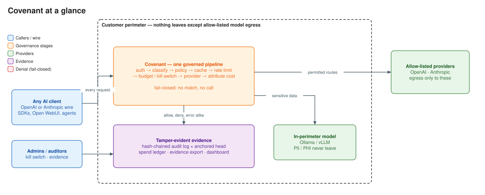
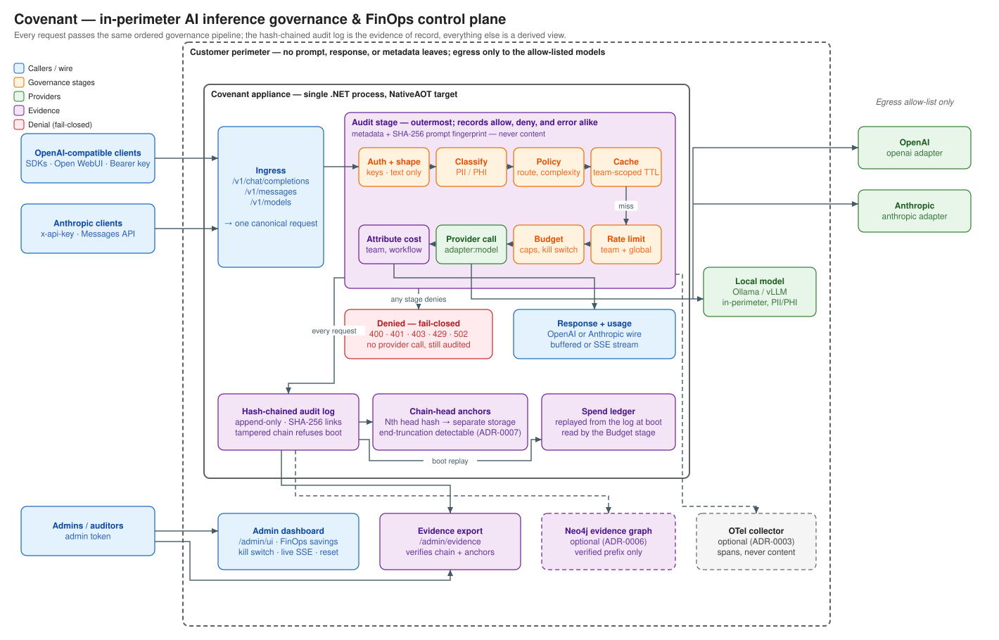

# Covenant

An in-perimeter **AI inference governance and FinOps control plane** for regulated environments (BFSI first). Every LLM request passes through one governed pipeline: classified, policy-routed, budget-checked, cost-attributed, and audited — including the requests that get refused.

Research artifact: can inference governance be an architecturally separable control layer — enforceably, evidentially, and at acceptable cost?

## At a glance

## Architecture

**Color key:** 🔵 caller surface · 🟠 governance decisions · 🟢 model call · 🟣 evidence (attribution & audit) · 🔴 refusal

Editable sources: [`docs/diagrams/*.drawio`](docs/diagrams/) (open in [diagrams.net](https://app.diagrams.net); the SVGs open there too). Both are generated by `docs/diagrams/gen_diagram.py` — edit the node lists there, not the outputs.

## Working principles

1. **Fail-closed.** No policy match → deny. Unclassified defaults to the most restrictive class. Misconfiguration → the appliance refuses to start. PII/PHI never reaches a public provider because no public route exists for those classifications.
2. **Governance is the pipeline, not a bolt-on.** Every capability — classification, policy, budgets, attribution, audit — is an ordered stage in one middleware chain. Nothing bypasses it.
3. **Everything is evidence.** Each request, allowed or denied, appends exactly one hash-chained audit entry. Altering any past entry breaks every hash after it.
4. **The perimeter is sacred.** Deployed inside the customer boundary; egress only to the approved model allow-list; no phone-home.

## Where the detail lives

Architecture decisions: `docs/adr/` · code lineage: `docs/PROVENANCE.md` · area rules: `CLAUDE.md` files per directory · first-run instructions: `README-SCAFFOLD.md` (deleted once the build is stable).
